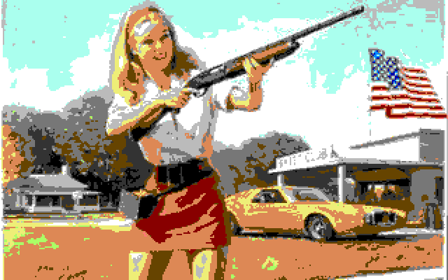
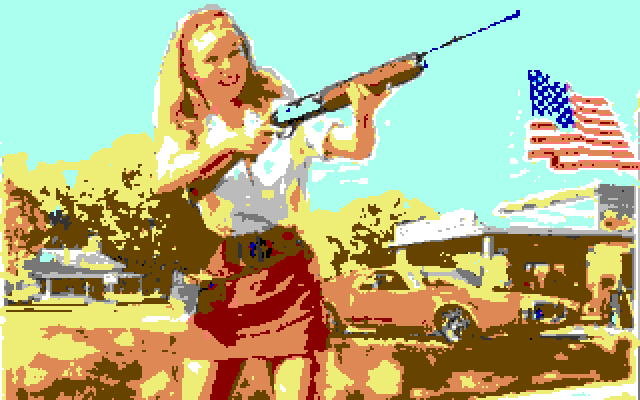
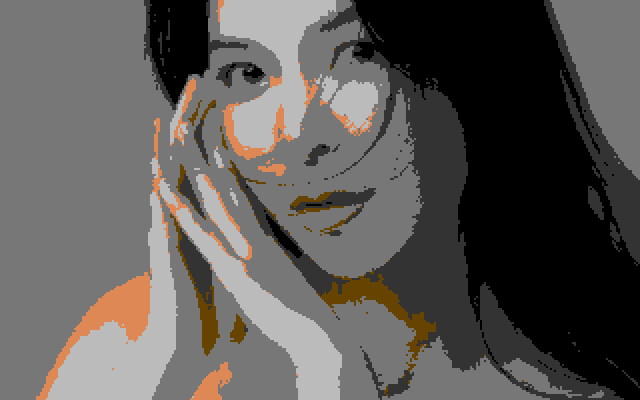
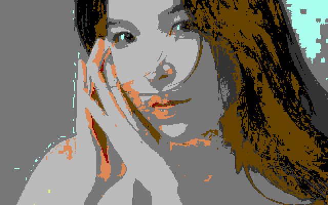
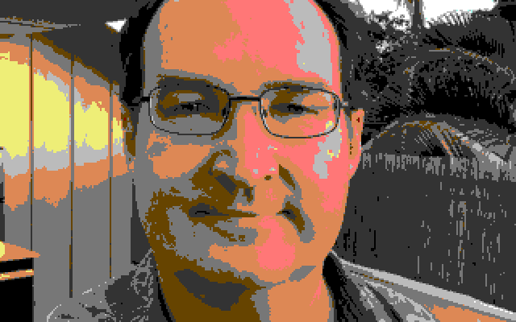
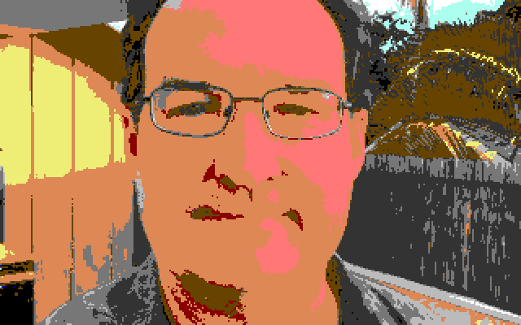

# C64Me

Work-in-progress. Currently reshapes photos to be 320x200 and converts every pixel to one of the 16 Commodore 64 colors. Pixels are not yet doubled or limited to 4 colors per 8x8 cell.

# Test Images

Original                 |RGB                               |HSB                               | Source
-------------------------|----------------------------------|----------------------------------|--------------------
 |  |  | Unknown
 |  |  | IG: [queennataliang](https://www.instagram.com/queennataliang)
 |  |  | Personal photo

