# C64Me

Work-in-progress. Currently reshapes photos to be 320x200 and converts every pixel to one of the 16 Commodore 64 colors. Pixels are not yet doubled or limited to 4 colors per 8x8 cell.

# Test Images

Original                 |Simple Color Mapping              |Advanced Color Mapping       |Advanced Color Mapping
-------------------------|----------------------------------|-----------------------------|------------------------------
 | 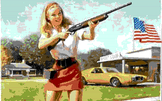 | 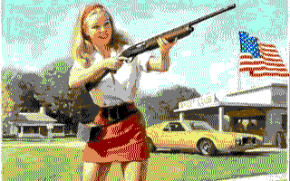|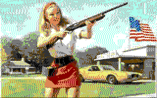
 | 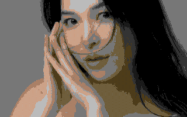 | 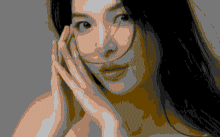|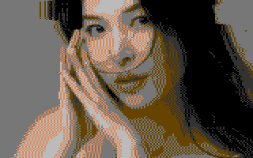
 | 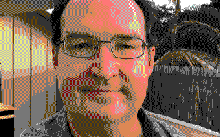 | 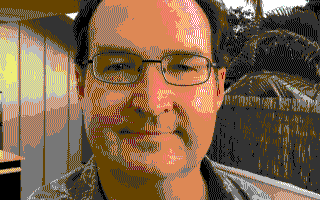|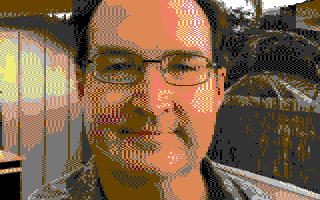
 | 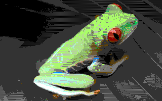 | 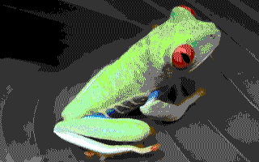|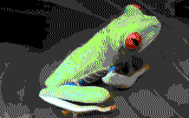
 |  | 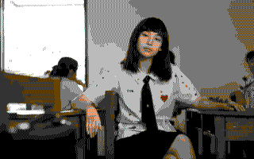|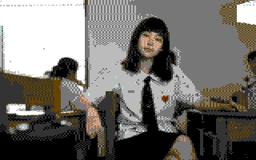
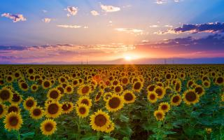 | 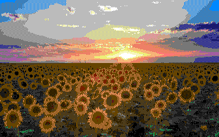 | 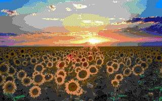|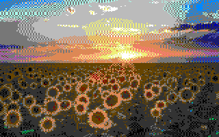
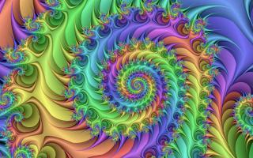 | 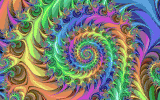 | 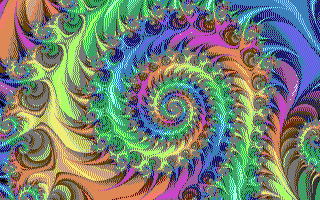|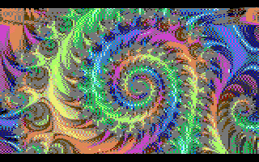
 | 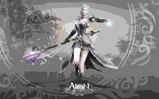 | 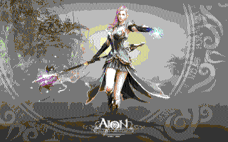|

